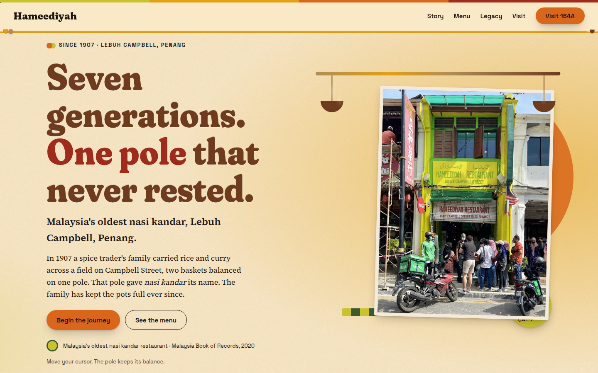
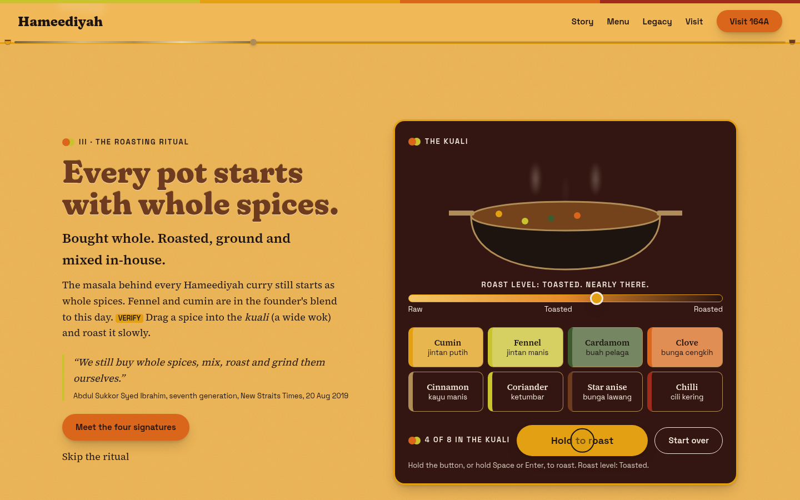
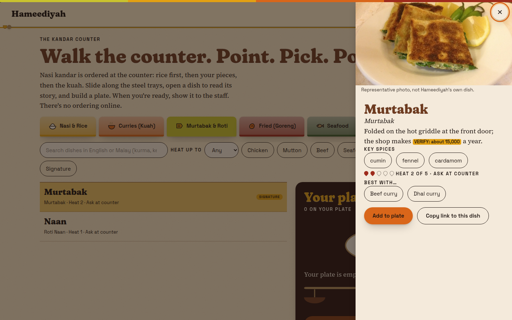
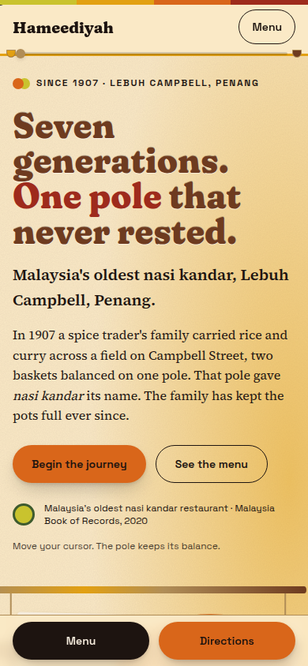
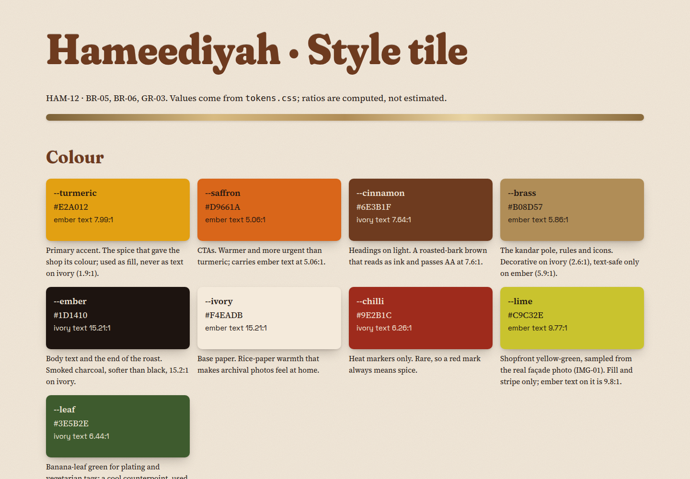

# Hameediyah · Design and strategy rationale

*The Pole That Never Rested.* A scroll-story for Penang's oldest nasi kandar restaurant, 164A Lebuh Campbell, since 1907.

Status: v1, written against the built site in `site/` (not yet deployed). Facts come from `docs/FACTS.md`; anything unconfirmed still carries `[VERIFY]` in the wireframes and is not used here.

## 1. Brand strategy

**Concept.** The kandar pole is the brand's origin and its name: *kandar* is the Malay word for the shoulder pole that carried two pots of curry. The family still serves from the same street, now in its seventh generation. So the site is one continuous journey the visitor carries forward, as the pole was carried: from a spice merchant's arrival from Tamil Nadu, to the docks, to a stall under a tree, to the shophouse, to the plate today. A thin brass pole is the progress bar, the divider, the menu's plate balance and the footer. One motif, repeated, is easier to remember than ten.

**Colour.** The palette is a spice rack, and each colour has a job.
- **Turmeric** is the accent and the founder's trade. It is a fill, never text on ivory (1.9:1).
- **Deep saffron** marks the actions. Ember text on it measures 5.06:1.
- **Roasted cinnamon** is ink for headings (7.6:1 on ivory).
- **Brass** is the pole, rules and icons: the metal of the original carrying gear.
- **Smoked ember** is body text and the end of the roast (15.2:1).
- **Ivory** is rice-paper ground, which lets archival photographs sit naturally.
- **Chilli red** appears only on heat markers, so red always means spice.
- **Banana-leaf green** appears on plating and vegetarian tags. The real shopfront is yellow-green; matching it exactly is a Phase 2 task.

The page also "roasts". Background moves through five steps from ivory to ember as the visitor scrolls, and every step keeps body text above AA contrast. The story gets darker and richer the way a spice does.

**Typography.** *Fraunces* for display: its ink-trap warmth reads hand-set, and its weight and softness axes can animate, so headlines thicken and soften as they arrive ("type that roasts"). *Source Serif 4* for body: bookish and readable, an archive-and-editorial voice. *Space Grotesk* for dates and labels: the feel of a trader's ledger. *Noto Serif Tamil* for single words and numerals only, honouring the founder's roots without pretending to full translation.

**Imagery.** Licensed archival photographs for authority, with drawn illustration to fill the gaps no photograph covers (dishes, the pole, spices). Photographs lift on hover like paper prints.

## 2. UX and motion

Each interaction exists to teach one real thing about the place, and each has a still fallback.

- **Voyage strip.** Scroll draws the route (vertical on mobile). It makes the journey physical. Reduced motion: full route drawn.
- **Then/Now slider.** Drag to wipe between archive and today. It shows 115 years of continuity in one gesture. It works by keyboard and falls back to side-by-side.
- **Roasting ritual.** Tap to add spices, hold to roast, watch the colour darken. Hameediyah roasts and grinds its spices in-house, so this is the signature moment, not decoration. Reduced motion: a four-frame storyboard.
- **Banjir.** Tap to flood a plate with mixed gravy, teaching a real ritual to first-timers. Fallback: an instant fill.
- **The Kandar Counter menu.** Six steel trays instead of a product grid, filters by heat and protein, a dish drawer with story and pairing, and a plate builder whose pole tips when the plate gets heavy. "Show at counter" gives a full-screen summary to show staff. There is no cart and no checkout, because ordering happens at the counter. Prices appear only where verified; otherwise "Ask at counter".

Everything is reachable by keyboard, touch targets are 44px on mobile, and reduced-motion users get complete content, not a lesser one: no preloader, no smooth scroll, no custom cursor, the route drawn in full and the roasting ritual shown as four steps.

## 3. Client pitch value

1. **Authority, made visible.** Malaysia Book of Records named Hameediyah the country's oldest nasi kandar restaurant on 7 July 2020. The site makes that title the opening story rather than a footnote.
2. **Tourism discovery.** Visitors who search for Penang heritage food find a story worth sharing, with directions, hours and the shopfront on one clear visit block.
3. **First-timer confidence.** A first visit means choosing from a long counter at speed. Heat levels, pairings and the plate builder lower that barrier, so more people walk in and order well.
4. **Shareability.** Every dish has a deep link, and the roasting ritual and Then/Now slider are made to be passed around.
5. **Press-kit value.** A founder story, an archive and a timeline give journalists ready, accurate material in place of an inbox request.
6. **Room to grow.** The same structure can take reservations, merchandise and a 120-year anniversary chapter in 2027, without a redesign.

## 4. What we did not build

No delivery grid, no add-to-cart, no stock "hero plus three columns" page, and no uniform card layout. A food-delivery look would make Hameediyah one of a thousand listings; its only real advantage is that it cannot be copied. Each section has to answer "why could this only be Hameediyah?", and the four chapters of the signature dishes deliberately use four different layouts.

## Plain-text summary (for `submission.txt`)

Hameediyah is Penang's oldest nasi kandar restaurant, open since 1907 and now in its seventh generation. Our concept, "The Pole That Never Rested", turns the site into one continuous journey that the visitor carries forward the way the founder carried two pots of curry on a shoulder pole (kandar). A brass pole is the progress bar, divider and menu balance. The page "roasts" as you scroll, moving from ivory to smoked ember.

The palette comes from the spice rack: turmeric, saffron, roasted cinnamon, brass and ember, all tested for AA contrast. Fraunces gives hand-set warmth that thickens as headlines arrive; a bookish serif carries the story; a ledger-style grotesque handles dates and labels.

Five interactions each teach one real thing: a scroll-drawn voyage, a Then/Now archive slider, a spice-roasting ritual, a gravy-flood (banjir) ritual, and the Kandar Counter menu, with steel trays, heat filters, a plate builder and a show-at-counter screen instead of a cart. Every interaction has a keyboard path and a reduced-motion fallback.

For the client it means: the Book of Records title on display, easier discovery for visitors, more confident first orders, shareable dish links, ready press material, and room for reservations and the 120-year anniversary.

## Screenshots (the built site, local build)

